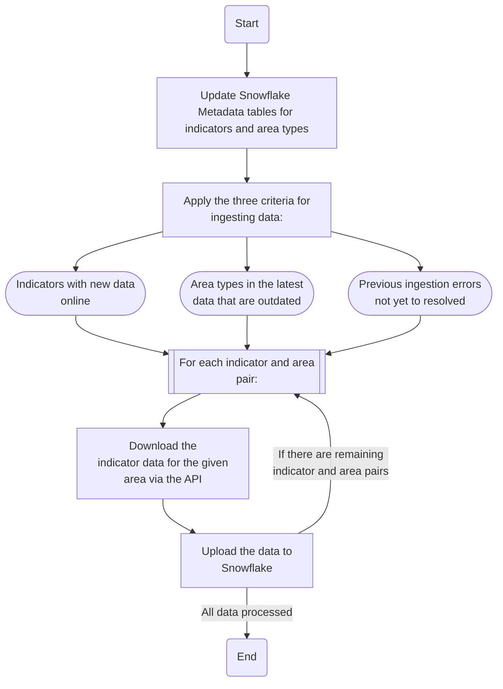

# NCL Cancer Alliance - Fingertips Ingestion

Ingestion pipeline to pull select fingertips data into snowflake.

The pipeline maintains the following DATA_LAKE__NCL.FINGERTIPS tables:
- INDICATOR_DATA: Indicator data
- INGESTION_ERROR_LOG: Log of indicators that fail to ingest when the code is run
- METADATA_AREA: Metadata information on areas
- METADATA_INDICATOR: Metadata information on indicators

In the Snowflake environment the following views are also included in DATA_LAKE__NCL.FINGERTIPS:
- INDICATOR_AREA_MISMATCH: Highlights instances of indicator data using outdated boundaries (i.e. PCN groupings)
- INDICATOR_UPDATE_LOG: Local tracking of what data has been ingested

This project uses the [fingertips-py package](https://fingertips-py.readthedocs.io/en/latest/) to pull data and outputs data in the format output by `fingertips_py.get_data_by_indicator_ids(indicator_id, area_id)`.

The output indicator data is also appended with the AREA_ID used when requesting the data and the "Date updated" field from the indicator metadata in order to track what version of the data exists in Snowflake.

The METADATA_INDICATOR table is sourced using the `fingertips_py.get_metadata_for_all_indicators_from_csv()` function.
The METADATA_AREA table is sourced using the `fingertips_py.get_all_areas()` function.

When the code is executed, only "new" data is processed. There are **three criterias** for the code considering data to be "new":
- The "Date updated" field for a given indicator in the Indicator metadata from the API is more recent than what is available in the Snowflake data
- For a given Area ID, the Area Type Name is different in the Area metadata from the API compared to what is used in the latest data in Snowflake. (This happens for some Area IDs with changing boundaries like PCNs. The Area Type in the Snowflake data might be "PCNs (v. 26/06/25)" while the Area Type in the metadata is "PCNs (v.28/07/2025)" implying the data currently online was recalculated with the newer boundary definition.)
- There are rows in the INGESTION_ERROR_LOG table with a _TIMESTAMP value more recent than the data in the INDICATOR_DATA table. This implies there was an ingestion error when the code was previous ran but the new data is still not in the data table.

### Code Overview

## Scripting Guidance

Please refer to the Internal Scripting Guide documentation for instructions on setting up coding projects including virtual environments (venv) and environmental variables (.env).

The Internal Scripting Guide is available here: [Internal Scripting Guide](https://nhs.sharepoint.com/:w:/r/sites/msteams_38dd8f/Shared%20Documents/Document%20Library/Documents/Git%20Integration/Internal%20Scripting%20Guide.docx?d=wc124f806fcd8401b8d8e051ce9daab87&csf=1&web=1&e=qt05xI)

## Usage

**Note that running this code requires access to the ENGINEER role**

### First Time Setup

* Follow the guide for "Setting up a New Coding Project" in the [Internal Scripting Guide](https://nhs.sharepoint.com/:w:/r/sites/msteams_38dd8f/Shared%20Documents/Document%20Library/Documents/Git%20Integration/Internal%20Scripting%20Guide.docx?d=wc124f806fcd8401b8d8e051ce9daab87&csf=1&web=1&e=qt05xI) and set up the Virtual Environment.

* Create a .env file using the sample.env as a reference. Use the Internal Scripting Guide for further guidance. The ACCOUNT, USER, and ROLE fields need to be populated using information from your Snowflake account.

### Regular Use

* Execute src/main.py

When executed the code will fully refresh the METADATA_INDICATOR and METADATA_AREA tables with the latest available definitions.

## Changelog

### [1.0.0] - 2025-08-01
#### Added
- Initial working version of the project.

### [1.1.0] - 2025-09-30
#### Modified
- Changed API download code to pull data per area iteratively instead of all at once to prevent failure due to excessive data downloading.
- Indicator IDs are set in the target_indicator.csv file

### [1.2.0] - 2025-10-15
#### Modified
- Instead of a trimmed list of relevant indicators, the code now maintains all available indicators. The target_indicator.csv is now redundant and removed.
- AREA_ID was added to the ingested data due to issues with joining on "Area Type". Specifically issues with the Area Type in the data not aligning to the Area Type in the meta table when boundaries change (i.e. PCN)
- Instead of just looking for updated metrics there are now the three criteria for updating data as documented above.

## Licence
This repository is dual licensed under the [Open Government v3]([https://www.nationalarchives.gov.uk/doc/open-government-licence/version/3/) & MIT. All code can outputs are subject to Crown Copyright.

## Contact
Jake Kealey - jake.kealey@nhs.net
