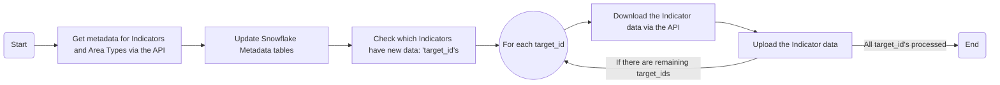

# NCL Cancer Alliance - Fingertips Ingestion

Ingestion pipeline to pull select fingertips data into snowflake.

The pipeline maintains 3 bronze tier tables:
- CANCER_FINGERTIPS: Indicator data
- INDICATOR_METADATA: Metadata information on indicators
- INDICATOR_UPDATE_LOG: Local tracking of what data has been ingested

This project uses the [fingertips-py package](https://fingertips-py.readthedocs.io/en/latest/) to pull data and outputs data in the format used by `fingertips_py.get_data_for_indicator_at_all_available_geographies(id)`.

The output indicator data is also appended with the "Date updated" field from the indicator metadata in order to track what version of the data exists in Snowflake.

The INDICATOR_METADATA table is sourced using the `fingertips_py.get_metadata_for_all_indicators_from_csv()` function.

### Code Overview

## Scripting Guidance

Please refer to the Internal Scripting Guide documentation for instructions on setting up coding projects including virtual environments (venv) and environmental variables (.env).

The Internal Scripting Guide is available here: [Internal Scripting Guide](https://nhs.sharepoint.com/:w:/r/sites/msteams_38dd8f/Shared%20Documents/Document%20Library/Documents/Git%20Integration/Internal%20Scripting%20Guide.docx?d=wc124f806fcd8401b8d8e051ce9daab87&csf=1&web=1&e=qt05xI)

## Usage

### First Time Setup

* Follow the guide for "Setting up a New Coding Project" in the [Internal Scripting Guide](https://nhs.sharepoint.com/:w:/r/sites/msteams_38dd8f/Shared%20Documents/Document%20Library/Documents/Git%20Integration/Internal%20Scripting%20Guide.docx?d=wc124f806fcd8401b8d8e051ce9daab87&csf=1&web=1&e=qt05xI) and set up the Virtual Environment.

* Create a .env file using the sample.env as a reference. Use the Internal Scripting Guide for further guidance. The ACCOUNT, USER, and ROLE fields need to be populated using information from your Snowflake account.

### Regular Use

* Set the INDICATORS field in the .env file to the list of indicators you want to pull data for. If all destination tables are set up as expected, the code will only pull data for indicators where there is new data not currently logged in the INDICATOR_UPDATE_LOG.

* Execute src/main.py

When executed the code will fully refresh the METADATA_INDICATOR and METADATA_AREA tables with the latest available definitions.

## Changelog

### [1.0.0] - 2025-08-01
#### Added
- Initial working version of the project.

## Licence
This repository is dual licensed under the [Open Government v3]([https://www.nationalarchives.gov.uk/doc/open-government-licence/version/3/) & MIT. All code can outputs are subject to Crown Copyright.

## Contact
Jake Kealey - jake.kealey@nhs.net
